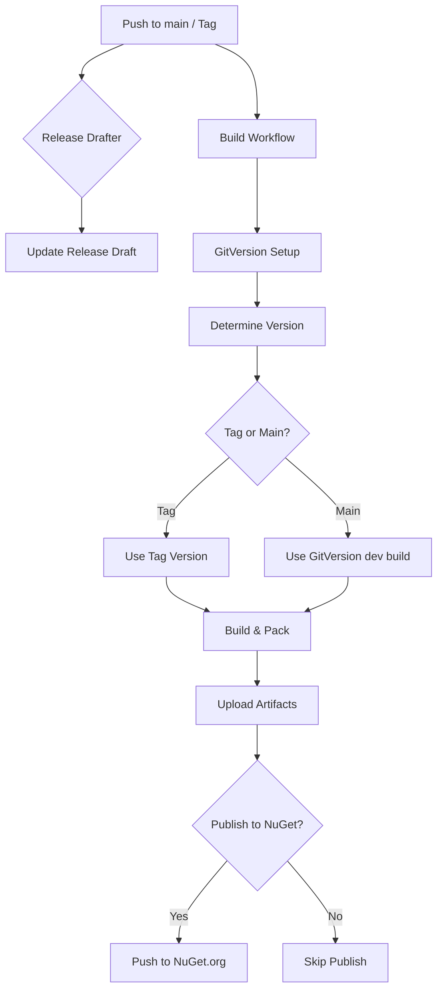
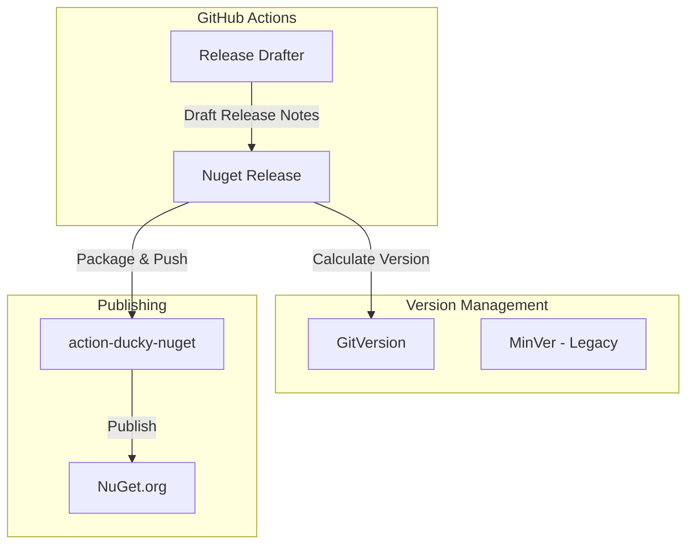

# Change: Automated Build and Release Workflow

## Why

The project currently lacks automated CI/CD infrastructure for building, versioning, and publishing NuGet packages. This creates manual overhead for releases and inconsistent version management compared to the Ducky.Sdk ecosystem.

## What Changes

- **ADDED**: Release Drafter workflow for automatic release note generation
- **ADDED**: GitHub Actions workflow for automated NuGet package building and publishing
- **ADDED**: GitVersion configuration for semantic versioning (replacing MinVer)
- **ADDED**: NuGet packaging configuration for .NET Standard 2.1 compatibility
- **MODIFIED**: Version management from MinVer to GitVersion
- **ADDED**: GitHub Actions workflow integration with action-ducky-nuget
- **ADDED**: Secret configuration documentation for NuGet API keys

## Code Flow Changes

### Current Build Flow

```
Developer Commit
    ↓
Manual Build (dotnet build)
    ↓
Manual Version (MinVer auto-generates)
    ↓
Manual Pack (dotnet pack)
    ↓
Manual Publish (dotnet nuget push)
```

### Proposed Automated Build Flow



### Architecture Integration



## Impact

### Affected Specs
- `ci-cd` (new capability)

### Affected Code
- **New Files**:
  - `.github/workflows/release-drafter.yml`
  - `.github/workflows/publish.yml`
  - `GitVersion.yml`
  - `.github/release-drafter.yml` (configuration)
- **Modified Files**:
  - `Directory.Packages.props` (remove MinVer, add GitVersion tool reference)
  - `SuperDucky.Connector.csproj` (optional: update versioning configuration)

### Dependencies
- **External**:
  - `release-drafter/release-drafter@v6` (GitHub Action)
  - `gittools/actions-gitversion/setup@v4.2.0` (GitHub Action)
  - `actions/setup-dotnet@v4` (GitHub Action)
  - `ducky7go/action-ducky-nuget` (Custom GitHub Action)
- **Reference Implementations**:
  - `/home/newbe36524/repos/newbe36524/Ducky.Sdk/.github/workflows/` (Release Drafter + Publish workflows)
  - `/home/newbe36524/repos/newbe36524/action-ducky-nuget/action.yml` (Mod publishing action)

### Risks / Considerations
- **GitVersion vs MinVer Migration**: GitVersion configuration must be carefully set up to maintain version continuity
- **Secret Management**: NuGet API keys must be securely stored in GitHub Secrets
- **.NET Standard 2.1**: Build workflow must target correct framework
- **Initial Release**: First automated release may require manual version tagging
- **CI/CD Pipeline**: Workflow must handle both tag-based (formal releases) and main branch (dev builds) scenarios

## Success Criteria
1. **Release Drafter** automatically creates/updates release notes on push to main
2. **Build Workflow** successfully builds and packages NuGet for both tags and main branch
3. **GitVersion** correctly generates semantic versions (X.Y.Z and X.Y.Z-dev.N)
4. **Publish Workflow** successfully pushes packages to NuGet.org
5. **Artifacts** are uploaded and retained for 30 days
6. **Documentation** covers secret setup and workflow usage

## Migration Path
1. Add GitVersion configuration alongside existing MinVer (compatibility period)
2. Create GitHub Actions workflows in draft/paused state
3. Configure GitHub Secrets (NUGET_KEY, optional MYGET_API_KEY)
4. Test workflows with manual trigger or test branch
5. Enable workflows after validation
6. Remove MinVer after successful GitVersion integration
