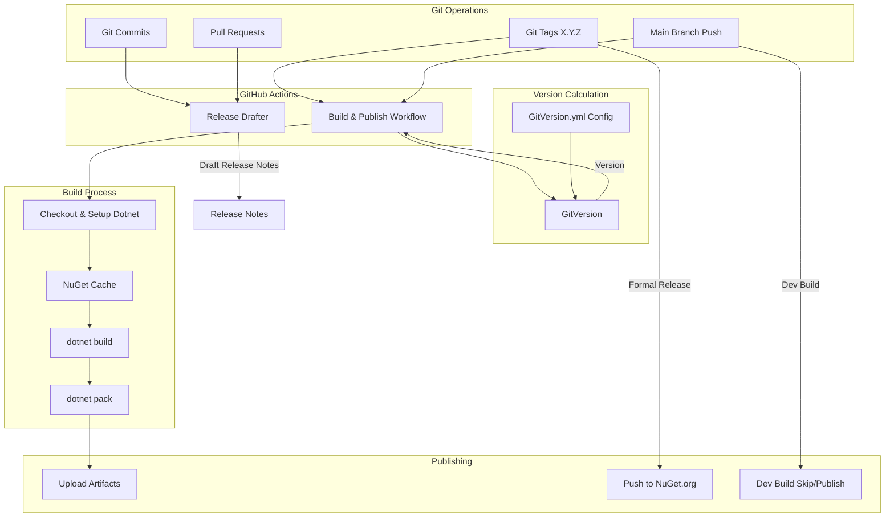

## Context

SuperDucky.Connector is a .NET Standard 2.1 game mod that currently uses MinVer (6.0.0) for automatic versioning. The project needs to establish an automated CI/CD pipeline for building, versioning, and publishing NuGet packages, following patterns established in the Ducky.Sdk ecosystem.

### Current State
- **Version Management**: MinVer (6.0.0) - auto-generates versions from git history
- **Build Process**: Manual `dotnet build` and `dotnet pack`
- **Publishing Process**: Manual `dotnet nuget push`
- **Release Notes**: Manual documentation
- **CI/CD**: None (no GitHub Actions workflows)

### Reference Implementations
- **Ducky.Sdk** (`/home/newbe36524/repos/newbe36524/Ducky.Sdk/`)
  - Uses GitVersion for semantic versioning
  - Has Release Drafter workflow for automatic release notes
  - Has publish workflow for NuGet distribution
- **action-ducky-nuget** (`/home/newbe36524/repos/newbe36524/action-ducky-nuget/`)
  - Reusable GitHub Action for mod packaging
  - Handles NuGet Mod Packaging Specification v1.0

## Goals / Non-Goals

### Goals
- Establish automated release note generation via Release Drafter
- Implement GitHub Actions workflow for building and packaging NuGet
- Integrate GitVersion for semantic versioning (replacing MinVer)
- Enable automated publishing to NuGet.org on tags/main branch pushes
- Maintain .NET Standard 2.1 compatibility throughout CI/CD pipeline
- Align with Ducky.Sdk release patterns for ecosystem consistency

### Non-Goals
- Supporting multiple NuGet feeds beyond NuGet.org (MyGet is optional, per reference)
- Automated testing in CI (unit tests run manually for now)
- Automated changelog generation beyond Release Drafter
- Version migration utilities (GitVersion will establish new baseline)

## Decisions

### Decision 1: GitVersion over MinVer

**What**: Migrate from MinVer to GitVersion for version management.

**Why**:
- GitVersion provides explicit configuration for mainline development with dev builds (X.Y.Z-dev.N format)
- Aligns with Ducky.Sdk's versioning strategy
- Better support for CI/CD pipelines with deterministic version calculation
- More flexible branching strategies if needed in future

**Alternatives Considered**:
1. **Keep MinVer**: Simpler, but lacks explicit CI/CD integration patterns used in Ducky.Sdk
2. **Manual Versioning**: Too error-prone, defeats purpose of automation
3. **Custom Version Script**: Reinventing the wheel, maintenance burden

**Configuration**:
```yaml
mode: Mainline
branches:
  main:
    regex: ^main$|^master$
    mode: ContinuousDelivery
    tag: ''
    increment: Patch
    prevent-increment-of-merged-branch-version: true
    track-merge-target: false
    source-branches: ['feature', 'pull-request']
    regex: ^features?/[a-z]/
    mode: ContinuousDelivery
    tag: $2
```

### Decision 2: Dual-Trigger Workflow

**What**: Support both tag-based (formal releases) and main branch (dev builds) publishing.

**Why**:
- Tags (X.Y.Z) represent formal, stable releases to NuGet.org
- Main branch builds (X.Y.Z-dev.N) allow continuous testing and integration
- Matches Ducky.Sdk's established pattern
- Enables rapid iteration without formal release overhead

**Trigger Conditions**:
- **Tags**: `refs/tags/*.*.*` → formal release version, always publish
- **Main Branch**: `refs/heads/main` → dev build version, optional publish

### Decision 3: Release Drafter Integration

**What**: Use release-drafter/release-drafter@v6 for automatic release notes.

**Why**:
- Proven solution used in Ducky.Sdk
- Categorizes commits by conventional commit prefixes
- Maintains draft release that updates on each merge
- Zero configuration beyond basic label setup

**Configuration**:
```yaml
categories:
  - title: 'Features'
    labels: ['feature']
  - title: 'Bug Fixes'
    labels: ['bugfix']
  - title: 'Documentation'
    labels: ['documentation']
```

### Decision 4: action-ducky-nuget Integration

**What**: Reference action-ducky-nuget patterns but implement project-specific workflow.

**Why**:
- action-ducky-nuget is designed for game mod publishing with specific NuGet Mod Packaging Specification
- SuperDucky.Connector is a NuGet library, not a mod bundle
- Need more control over build/pack process than composite action provides
- Can adapt patterns without direct action dependency

**Implementation**: Create custom publish.yml workflow inspired by Ducky.Sdk's publish.yml, adapted for library packaging.

## Technical Design

### Architecture



### Workflow Specifications

#### 1. Release Drafter Workflow

**File**: `.github/workflows/release-drafter.yml`

**Triggers**:
- Push to `main` branch
- Pull requests (opened, reopened, synchronize)

**Permissions**:
- `contents: read` (default)
- `contents: write` (for update_release_draft job)
- `pull-requests: write` (for autolabeler)

**Action**: `release-drafter/release-drafter@v6`

**Output**: Maintains a "Next Release" draft that updates on each merge

#### 2. Build & Publish Workflow

**File**: `.github/workflows/publish.yml`

**Triggers**:
- Push to tags: `*.*.*`
- Push to `main` branch

**Steps**:
1. **Checkout**: `actions/checkout@v4` with `fetch-depth: 0`
2. **Setup .NET**: `actions/setup-dotnet@v4`
3. **Cache NuGet**: `actions/cache@v4` for `~/.nuget/packages`
4. **Install GitVersion**: `gittools/actions-gitversion/setup@v4.2.0`
5. **Execute GitVersion**: `gittools/actions-gitversion/execute@v4.2.0`
6. **Determine Version**:
   - If tag: Use tag name (X.Y.Z)
   - If main: Use GitVersion fullSemVer (X.Y.Z-dev.N)
7. **Build & Pack**: `dotnet pack` with determined version
8. **Upload Artifacts**: Retain for 30 days
9. **Push to NuGet**:
   - Tags: Always push
   - Main: Push (configurable via workflow input or secret)

**Secrets Required**:
- `NUGET_KEY`: NuGet.org API key (required for publishing)
- `MYGET_API_KEY`: (optional) MyGet feed API key

### GitVersion Configuration

**File**: `GitVersion.yml`

**Key Settings**:
```yaml
mode: Mainline
next-version: 1.0.0
branches:
  main:
    mode: ContinuousDelivery
    tag: ''
    increment: Patch
ignore:
  sha: []
```

**Version Output Examples**:
- Tag `1.2.3`: Version = `1.2.3`
- Main branch (5 commits since tag): Version = `1.2.4-dev.5`

### Project Configuration Changes

**Directory.Packages.props**:
- **Remove**: `<PackageVersion Include="MinVer" Version="6.0.0" />`
- **Add**: GitVersion tool reference (via global.json or Directory.Build.props)

**SuperDucky.Connector.csproj**:
- No changes required (GitVersion injects version via MSBuild)

### Migration from MinVer

**Phase 1: Setup** (Compatibility)
1. Add GitVersion.yml configuration
2. Add GitVersion GitHub Actions workflow
3. Keep MinVer in project temporarily
4. Validate GitVersion output matches MinVer

**Phase 2: Switch**
1. Remove MinVer PackageReference
2. Add GitVersion MSBuild integration to Directory.Build.props:
   ```xml
   <Import Project="build\GitVersion.msbuild"
           Condition="Exists('build\GitVersion.msbuild')" />
   ```

**Phase 3: Cleanup**
1. Remove any MinVer-specific configuration
2. Update documentation
3. Archive migration notes

## Risks / Trade-offs

### Risk 1: Version Continuity

**Risk**: Switching from MinVer to GitVersion may cause version jumps or gaps.

**Mitigation**:
- Use `next-version` in GitVersion.yml to set baseline
- Run GitVersion locally to validate before CI/CD enablement
- Tag current version before migration if needed

**Trade-off**: Slight complexity overhead for better control.

### Risk 2: Secret Management

**Risk**: NuGet API key exposure or misconfiguration.

**Mitigation**:
- Use GitHub Secrets (encrypted at rest)
- Document secret setup in CONTRIBUTING.md
- Use least-privilege API key (push-only, no account management)

**Trade-off**: Operational complexity for security.

### Risk 3: .NET Standard 2.1 Build Compatibility

**Risk**: GitHub Actions runners may not support .NET Standard 2.1 tooling by default.

**Mitigation**:
- Use `actions/setup-dotnet@v4` with explicit global.json
- Validate build output framework version
- Add build step to verify target framework

**Trade-off**: Additional workflow configuration steps.

### Risk 4: Action-ducky-nuget Misalignment

**Risk**: action-ducky-nuget designed for mod bundles, not libraries.

**Mitigation**:
- Reference patterns only, not direct action usage
- Implement custom workflow for library packaging
- Use `dotnet pack` instead of mod-specific scripts

**Trade-off**: More workflow code to maintain.

### Risk 5: Main Branch Spam

**Risk**: Every push to main generates dev build and potentially publishes.

**Mitigation**:
- Use `continue-on-error: true` for dev build publishing
- Consider publishing to separate feed (e.g., MyGet dev feed)
- Make main branch publishing optional via workflow input

**Trade-off**: CI/CD noise vs rapid iteration.

## Migration Plan

### Pre-Migration (Manual Steps)

1. **Tag Current Version**:
   ```bash
   git tag -a v1.0.0 -m "Initial release before GitVersion migration"
   git push origin v1.0.0
   ```

2. **Setup GitHub Secrets**:
   - Navigate to repository Settings → Secrets and variables → Actions
   - Add `NUGET_KEY` (from https://www.nuget.org/account/apikeys)
   - (Optional) Add `MYGET_API_KEY`

3. **Create global.json**:
   ```json
   {
     "sdk": {
       "version": "9.0.100"
     }
   }
   ```

### Implementation Steps

1. **Add GitVersion Configuration**:
   - Create `GitVersion.yml`
   - Commit to `main` branch

2. **Create GitHub Workflows**:
   - `.github/workflows/release-drafter.yml`
   - `.github/workflows/publish.yml`
   - Commit to `main` branch

3. **Update Project Files**:
   - Remove MinVer from `Directory.Packages.props`
   - Add GitVersion MSBuild import to `Directory.Build.props`

4. **Validate Locally**:
   - Install GitVersion dotnet tool: `dotnet tool install --global GitVersion.Tool`
   - Run: `dotnet-gitversion` to verify version output

5. **Test Workflows**:
   - Push to feature branch to verify workflow triggers
   - Check Actions tab for workflow runs
   - Validate artifact uploads

6. **Enable Publishing**:
   - Merge to main branch
   - Monitor first automated build/publish
   - Verify NuGet package availability

### Rollback Plan

If GitVersion migration fails:

1. **Revert Project Files**:
   - Restore MinVer PackageReference
   - Remove GitVersion import

2. **Disable Workflows**:
   - Rename `.github/workflows/` to `.github/workflows.disabled/`

3. **Restore Version Tags**:
   - Git allows tag reassignment if needed: `git tag -d v1.0.0 && git push origin :refs/tags/v1.0.0`

### Post-Migration

1. **Update Documentation**:
   - Add CI/CD section to README.md
   - Document release process (tagging → automated publish)
   - Add troubleshooting guide

2. **Monitor Initial Releases**:
   - Verify NuGet packages are valid
   - Check symbol packages (.snupkg) if enabled
   - Validate version numbers follow expectations

3. **Archive Migration Notes**:
   - Move this design.md to `changes/archive/` after successful deployment

## Open Questions

### Q1: Should dev builds publish to NuGet.org?

**Options**:
1. **Yes**: Every main branch push publishes X.Y.Z-dev.N to NuGet
2. **No**: Dev builds upload artifacts only, no publish
3. **Separate Feed**: Dev builds publish to MyGet, stable to NuGet.org

**Recommendation**: Option 2 (No) for initial implementation. Dev builds can be enabled later via workflow modification if continuous integration proves valuable.

### Q2: How to handle first automated release?

**Context**: Project may not have existing Git tags establishing version baseline.

**Options**:
1. **Tag manually**: Create v1.0.0 tag before enabling workflows
2. **GitVersion auto**: Let GitVersion calculate from first commit
3. **Hybrid**: Set `next-version: 1.0.0` in GitVersion.yml

**Recommendation**: Option 3 (Hybrid). Set explicit baseline in config, allows auto-calculation for subsequent releases.

### Q3: Symbol package (.snupkg) generation?

**Context**: NuGet supports symbol packages for debugging.

**Options**:
1. **Enable**: Generate .snupkg alongside .nupkg
2. **Disable**: Symbol packages not needed for mod library

**Recommendation**: Option 1 (Enable). Low overhead, valuable for consumers debugging. Add `/p:IncludeSymbols=true` to pack command.

### Q4: Release Drafter categorization labels?

**Context**: Need to define commit categories for release notes.

**Options**:
1. **Ducky.Sdk labels**: Use existing label scheme
2. **Custom labels**: Define project-specific categories
3. **Default**: Use release-drafter defaults

**Recommendation**: Option 1 (Ducky.Sdk labels) for ecosystem consistency:
- `feature` → Features
- `bugfix` → Bug Fixes
- `documentation` → Documentation
- `performance` → Performance Improvements
